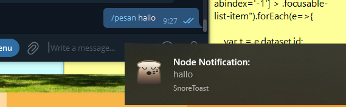

# bot-telegram-exec-cmd

terdapat 3 perintah 
```bat
/cmd untuk mengeksekusi perintah ke cmd
  - contoh 
  /cmd ping google.com
  /cmd shutdown /r 
  
/pesan mengirim notifikasi ke windows 
  - contoh 
  /pesan hallo semua
  
/photo untuk mengambil gambar dari webcam 
```



cara agar bisa dijalankan waktu windows dinyalakan 
npm install pm2 -g

lalu tekan tombol logo Windows  + R, ketik shell:startup, lalu pilih OK. Folder Startup akan terbuka.
buat shortcut lalu pilih app.bat
